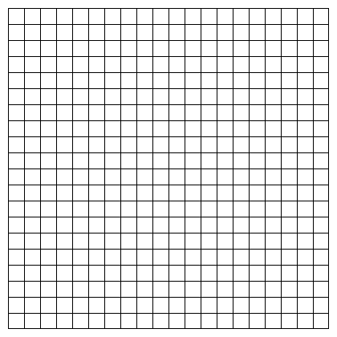

# Procedural Maze Generator 

## Overview

A project for procedurally generating two-dimensional mazes using various algorithms.

The current available maze generation algorithms are:

- Aldous-Broder
- Binary Tree
- Sidewinder
- Wilson's

## Dependencies

- C++ 23 (Tested with MSVC Version 19.37.32824)
- CMake (Minimum Version Required: 3.28)
- vcpkg
    - Google Test / Google Mock
    - OpenCV

## Building

1. Clone the repository and extract it to a directory.
2. Open a terminal and navigate to the directory.
3. First, run the following
   command: `cmake -B Build/ -S . -DCMAKE_TOOLCHAIN_FILE="path to vcpkg/scripts/buildsystems/vcpkg.cmake"`
4. Then, run the following command: `cmake --build Build/ --config Config`, where Config is either Debug or Release.
5. The executable will be located within the Build/Console/Config/ directory, where Config is either Debug or Release.
7. Run the executable.

## Running Tests

1. Follow the steps in the Building section above to build the project.
2. The executable will be located within the Build/Test/Config/ directory, where Config is either Debug or Release.

## Usage

### Commands

- `export` - Exports a grid, modified or unmodified, to a PNG image.
- `grid` - Generates a grid.
- `help` - Displays the name and description of all commands.
- `maze` - Modifies a grid by applying a maze generation algorithm.
- `quit` - Quits the application.
- `version` - Displays the project version.
- `visualize` - Visualizes the generated grid or maze in the console using ASCII.

To get more information about the available commands, please refer to the `help` command.

### Examples

#### Exporting a Grid to a PNG Image

  ```
  > export -f Output.png -bs 5 -cs 20
  ```

#### Generating a Grid of Size 20x20

  ```
  > grid -s 20
  ```

#### Getting Help for the 'grid' Command

  ```
  > help -c grid
  ```

#### Modifying a Grid Using the Binary Tree Algorithm with Randomized Seed

  ```
  > maze -a BinaryTree
  ```

#### Modifying a Grid Using the Sidewinder Algorithm with Seed 12345

  ```
  > maze -a Sidewinder -s 12345
  ```

#### Visualizing a Grid

  ```
  > visualize -t grid
  ```

#### Visualizing a Maze

  ```
  > visualize -t maze
  ```

## Samples of Exported Grids and Mazes

### Grid



### Aldous-Broder Algorithm


### Binary Tree Algorithm


### Sidewinder Algorithm


### Wilson's Algorithm

